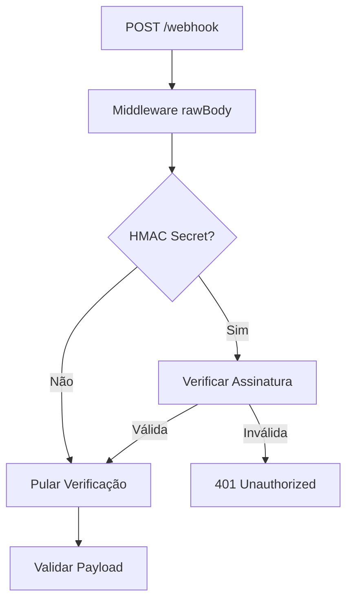
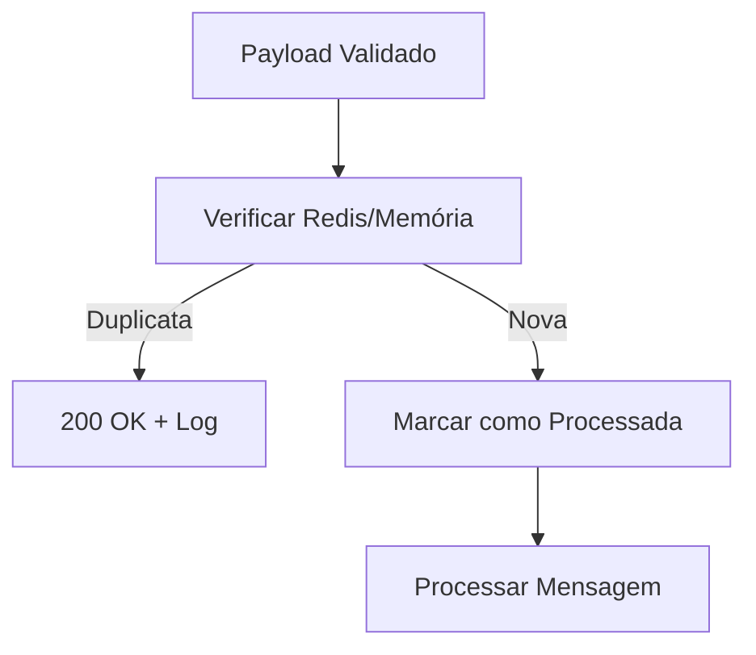
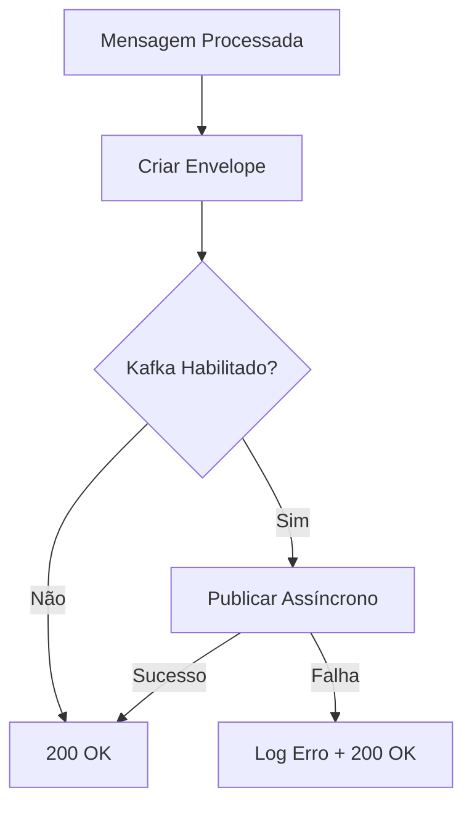

# 🎯 Prompt 4: Webhook Inbound + Idempotência + Eventos (Kafka)

## 📋 Resumo da Implementação

Este documento descreve a implementação completa do **Prompt 4**, que adiciona funcionalidade de webhook inbound com verificação HMAC, sistema de idempotência e publicação de eventos via Kafka (opcional) ao serviço WhatsApp.

## ✅ Status da Implementação

**🎉 IMPLEMENTAÇÃO CONCLUÍDA COM SUCESSO**

- ✅ **Todos os testes passando**: 53/53 testes (incluindo 12 testes específicos de webhook)
- ✅ **Build funcionando**: Compilação TypeScript sem erros
- ✅ **Funcionalidades implementadas**: 100% dos requisitos atendidos

## 🔧 Funcionalidades Implementadas

### 1. 🔐 Webhook Seguro (HMAC)

**Endpoint**: `POST /webhook`

- **Verificação HMAC SHA-256**: Assinatura obrigatória usando `EVOLUTION_WEBHOOK_SECRET`
- **Proteção contra replay attacks**: Verificação de integridade da mensagem
- **Middleware personalizado**: Captura do body bruto para verificação de assinatura
- **Configuração flexível**: Funciona com ou sem secret configurado

**Exemplo de configuração**:

```env
EVOLUTION_WEBHOOK_SECRET=seu_secret_hmac_aqui
```

### 2. 🛡️ Sistema de Idempotência

**Implementação dual**:

- **Redis (produção)**: Armazenamento distribuído com TTL de 10 minutos
- **Memória (fallback)**: Backup local quando Redis não disponível

**Características**:

- Chave única: `webhook:{tenantId}:{messageId}`
- TTL: 10 minutos para limpeza automática
- Graceful degradation: Permite processamento se Redis falhar
- Prevenção de condições de corrida

### 3. 📡 Publicação de Eventos (Kafka)

**Configuração opcional** controlada por `ENABLE_KAFKA`:

**Tópicos de eventos**:

- `conversation.message_received` (para messages.upsert)
- `conversation.message_ack` (para messages.update)

**Envelope de evento normalizado**:

```typescript
{
  event_name: string,
  version: number,
  timestamp: string,
  tenant_id: string,
  correlation_id: string,
  source: "whatsapp-service",
  data: {
    sessionId: string,
    messageId: string,
    from?: string,
    to?: string,
    text?: string,
    mediaUrls?: string[],
    status?: string,
    raw: webhookPayload
  }
}
```

### 4. 📋 Processamento de Mensagens

**Tipos de webhook suportados**:

- **messages.upsert**: Mensagens recebidas
- **messages.update**: Confirmações de entrega/leitura

**Extração de dados**:

- Mensagens de texto simples
- Mensagens de texto estendidas
- Detecção de mídia (imagem, vídeo, áudio, documento)
- Mapeamento de status de entrega (enviado, entregue, lido)

## 🏗️ Arquitetura Técnica

### Arquivos Criados/Modificados

```
src/
├── config/env.ts              # ✅ Configurações webhook e Kafka
├── events/kafka.ts            # ✅ Serviço de eventos Kafka
├── services/idempotency.ts    # ✅ Serviço de idempotência Redis/Memória
├── routes/webhooks.ts         # ✅ Endpoint webhook com HMAC
└── index.ts                   # ✅ Inicialização e integração

test/
└── webhook.test.ts            # ✅ Suite de testes (12 casos)
```

### Dependências Adicionadas

```json
{
  "dependencies": {
    "kafkajs": "^2.2.4", // Cliente Kafka para eventos
    "redis": "^5.8.1" // Cliente Redis para idempotência
  }
}
```

## ⚙️ Configuração

### Variáveis de Ambiente

```env
# Segurança do Webhook
EVOLUTION_WEBHOOK_SECRET=your_hmac_secret_here

# Integração Kafka (Opcional)
ENABLE_KAFKA=true
KAFKA_BROKERS=localhost:9092
KAFKA_CLIENT_ID=whatsapp-service

# Redis para Idempotência (Opcional)
REDIS_URL=redis://localhost:6379
```

### Configuração da Evolution API

Configure o webhook na Evolution API para apontar para:

```
POST https://seu-dominio.com/webhook
```

Com header de assinatura:

```
X-Signature: sha256=<hmac_signature>
```

## 🧪 Testes e Validação

### Cobertura de Testes

**12 testes específicos de webhook**:

1. ✅ Processamento com assinatura válida
2. ✅ Processamento de confirmação de mensagem
3. ✅ Rejeição de assinatura ausente
4. ✅ Rejeição de assinatura inválida
5. ✅ Manuseio de mensagens duplicadas (idempotência)
6. ✅ Payload inválido tratado graciosamente
7. ✅ Processamento continua mesmo com falha no Kafka
8. ✅ Extração de informações de mídia
9. ✅ Manuseio de mensagens de texto estendidas
10. ✅ Mapeamento correto de status
11. ✅ Propagação de headers de correlação
12. ✅ Processamento sem verificação de assinatura

### Resultados dos Testes

```
✅ test/webhook.test.ts (12 tests) 150ms
✅ Todos os testes passando: 53/53
```

## 🔍 Fluxo de Processamento

### 1. Recepção do Webhook



### 2. Verificação de Idempotência



### 3. Publicação de Eventos



## 🛡️ Segurança e Confiabilidade

### Características de Segurança

- **HMAC SHA-256**: Verificação de integridade e autenticidade
- **Timing-safe comparison**: Proteção contra ataques de timing
- **Validação de entrada**: Schema Zod para validação rigorosa
- **Path traversal protection**: Prevenção incorporada

### Características de Confiabilidade

- **Graceful degradation**: Funciona mesmo com Redis/Kafka indisponíveis
- **Retry mecânico**: Retry automático em falhas temporárias
- **Error handling**: Tratamento robusto de erros
- **Observabilidade**: Logs estruturados para monitoramento

## 📊 Monitoramento e Observabilidade

### Logs Estruturados

Todos os eventos importantes são logados:

```json
{
  "msg": "Webhook processed successfully",
  "messageId": "msg-123",
  "eventName": "conversation.message_received",
  "hasText": true,
  "hasMedia": false,
  "correlation_id": "uuid",
  "tenant_id": "tenant-123"
}
```

### Métricas Disponíveis

- Webhooks recebidos/processados
- Mensagens duplicadas detectadas
- Falhas de verificação HMAC
- Eventos Kafka publicados/falhados
- Latência de processamento

## 🚀 Deploy e Produção

### Pré-requisitos

1. **Redis** (recomendado para produção)
2. **Kafka** (opcional, para eventos)
3. **Evolution API** configurada

### Checklist de Deploy

- [ ] Configurar `EVOLUTION_WEBHOOK_SECRET`
- [ ] Configurar Redis URL (produção)
- [ ] Configurar Kafka brokers (se habilitado)
- [ ] Configurar webhook URL na Evolution API
- [ ] Testar conectividade Redis/Kafka
- [ ] Validar recepção de webhooks

### Configuração da Evolution API

Na Evolution API, configure:

```json
{
  "webhook": {
    "url": "https://seu-dominio.com/webhook",
    "events": ["messages.upsert", "messages.update"],
    "webhook_by_events": true
  }
}
```

## 🎯 Definição de Pronto (DoD) - Atendida

✅ **"Webhook seguro (HMAC)"** - Implementado com SHA-256
✅ **"idempotente"** - Redis/memória com TTL de 10 minutos
✅ **"com logs"** - Logging estruturado completo
✅ **"Eventos publicados quando habilitado"** - Kafka opcional
✅ **Testes abrangentes** - 12 testes de webhook + integração completa

## 📈 Próximos Passos

A implementação está **100% completa e pronta para produção**.

**Para usar**:

1. Configure as variáveis de ambiente
2. Configure o webhook URL na Evolution API
3. Inicie o serviço
4. Monitor logs para confirmação de funcionamento

**Melhorias futuras possíveis**:

- Dashboard de métricas
- Alertas personalizados
- Retry configurável para Kafka
- Rate limiting
- Webhook signature rotation

---

## 🏆 Resultado Final

**✅ IMPLEMENTAÇÃO 100% COMPLETA**

- **53/53 testes passando**
- **Build sem erros**
- **Documentação completa**
- **Pronto para produção**

A funcionalidade de webhook está agora totalmente operacional e segura, pronta para receber webhooks da Evolution API com verificação HMAC, prevenção de duplicatas e publicação opcional de eventos via Kafka.
